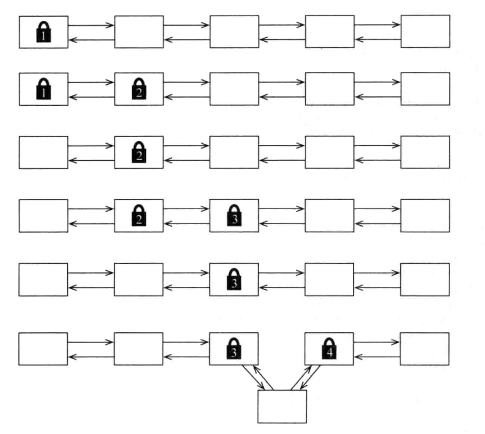

# 并发模型
## 并发（Concurrency）还是并行(Parallelism)
- 并发是对同一时间应对（dealing with）多件事情的能力
- 并行是同一时间动手做（doing）多件事情的能力
## 并行（Parallelism）架构
### 位级（bit-level）并行
32位处理器计算快于8位，64位处理器计算快于32位。
### 指令级（instruction-level）并行
流水线、乱序执行、猜测执行。
### 数据级（data）并行
单指令多数据（SIMD）架构，现代GPU。
### 任务级（task-level）并行
共享内存的多处理器架构、分布式内存的多处理器系统。
## 并发：不只是多核
### 并发的世界，并发的软件
与现实世界有效地交互，及时响应。
### 分布式的世界，分布式的软件
软件可以非同步地在多台计算机上执行任务，具有容错性。
### 不可预测的世界，容错性强的软件
关键是独立性和故障检测。
### 复杂的世界，简单的软件
现实世界的问题并发的解决方案往往更简单。

# 线程与锁
## 互斥和内存模型
### 竞态条件
```go
var count int
wg := new(sync.WaitGroup)
wg.Add(2)
for i := 0; i < 2; i++ {
	go func() {
		for j := 0; j < 100000; j++ {
			count++
		}
		wg.Done()
	}()
}
wg.Wait()
fmt.Println(count)
```
### 乱序执行
```go
for i := 0; i < 10; i++ {
	var (
		ready  bool
		answer int
	)
	wg := new(sync.WaitGroup)
	wg.Add(2)
	go func() {
		ready = true
		answer = 10
		wg.Done()
	}()
	go func() {
		if ready {
			fmt.Printf("the answer is %d\n", answer)
		} else {
			fmt.Printf("answer not ready, %d\n", answer)
			if answer != 0 {
				panic("answer is not 0")
			}
		}
		wg.Done()
	}()
	wg.Wait()
}
```
### 内存可见性
```go
for i := 0; i < 100; i++ {
	var ready bool
	wg := new(sync.WaitGroup)
	wg.Add(2)
	go func() {
		ready = true
		wg.Done()
	}()
	go func() {
		for !ready {
			fmt.Println("not ready")
			time.Sleep(time.Millisecond)
		}
		wg.Done()
	}()
	wg.Wait()
}
```
### 死锁
```java
class Chopstick {
	private int id;
	public Chopstick(int id) { 
        this.id = id; 
    }
    public int getId() { 
        return id; 
    }
}

class Philosopher extends Thread {
    private Chopstick left, right;
    private Random random;

    public Philosopher(Chopstick left, Chopstick right) {
        this.left = left; 
        this.right = right;
        random = new Random();
    }

    public void run() {
        try {
            while(true) {
                Thread.sleep(random.nextInt(1000));     // Think for a while
                synchronized(left) {                    // Grab left chopstick 
                        synchronized(right) {                 // Grab right chopstick 
                            Thread.sleep(random.nextInt(1000)); // Eat for a while
                    }
                }
            }
        } catch(InterruptedException e) {}
    }
}
```
### 外星方法
```java
class Downloader extends Thread {
    private InputStream in;
    private OutputStream out;
    private ArrayList<ProgressListener> listeners;

    public Downloader(URL url, String outputFilename) throws IOException {
        in = url.openConnection().getInputStream();
        out = new FileOutputStream(outputFilename);
        listeners = new ArrayList<ProgressListener>();
    }
    public synchronized void addListener(ProgressListener listener) {
        listeners.add(listener);
    }
    public synchronized void removeListener(ProgressListener listener) {
        listeners.remove(listener);
    }
    private synchronized void updateProgress(int n) {
        for (ProgressListener listener: listeners)
            listener.onProgress(n);
    }

    public void run() {
        int n = 0, total = 0;
        byte[] buffer = new byte[1024];

        try {
            while((n = in.read(buffer)) != -1) {
            out.write(buffer, 0, n);
            total += n;
            updateProgress(total);
        }
        out.flush();
        } catch (IOException e) { }
    }
}
```
### 总结
- 对共享变量的所有访问都需要同步化
- 读线程和写线程都需要同步化
- 按照约定的全局顺序来获取多把锁
- 持有锁时避免调用外星方法
- 持有锁的时间尽可能地短
## 超越内置锁
### 可中断的锁
```java
final ReentrantLock l1 = new ReentrantLock();
final ReentrantLock l2 = new ReentrantLock();
Thread t1 = new Thread() {
  public void run() {
    try {
      l1.lockInterruptibly();
      Thread.sleep(1000);
      l2.lockInterruptibly();
    } catch (InterruptedException e) { System.out.println("t1 interrupted"); }
  }
};
Thread t2 = new Thread() {
  public void run() {
    try {
      l2.lockInterruptibly();
      Thread.sleep(1000);
      l1.lockInterruptibly();
    } catch (InterruptedException e) { System.out.println("t2 interrupted"); }
  }
};
t1.start(); 
t2.start();
Thread.sleep(2000);
t1.interrupt(); 
t2.interrupt();
t1.join(); 
t2.join();
```
### 超时
```java
class Philosopher extends Thread {
    private ReentrantLock leftChopstick, rightChopstick;
    private Random random;

    public Philosopher(ReentrantLock leftChopstick, ReentrantLock rightChopstick) {
        this.leftChopstick = leftChopstick; 
        this.rightChopstick = rightChopstick;
        random = new Random();
    }

    public void run() {
        try {
            while(true) {
                Thread.sleep(random.nextInt(1000)); // Think for a while
                leftChopstick.lock();
                try {
                    if (rightChopstick.tryLock(1000, TimeUnit.MILLISECONDS)) {
                        // Got the right chopstick
                        try {
                            Thread.sleep(random.nextInt(1000)); // Eat for a while
                        } finally { rightChopstick.unlock(); }
                    } else {
                        // Didn't get the right chopstick - give up and go back to thinking
                        System.out.println("Philosopher " + this + " timed out");
                    }
                } finally { 
                    leftChopstick.unlock(); 
                }
            }
        } catch(InterruptedException e) {}
    }
}
```
### 交替锁（hand-over-hand locking）

### 条件变量
```go
c := sync.NewCond(new(sync.Mutex))
// ...
c.L.Lock()
for !condition() {
    c.Wait()
}
// ... make use of condition ...
c.L.Unlock()
// ...
c.Broadcast()
```
### 原子变量
### 总结  
- 在线程获取锁时中断它
- 设置线程锁的超时时间
- 按任意顺序获取和释放锁
- 用条件变量等待某个条件为真
- 使用原子变量避免锁的使用
## 站在巨人的肩膀上
### 线程池
### 写入时复制（copy on write）
### Blocking Queue
### Concurrent Hash Map
### 总结
- 使用线程池，而不直接创建线程
- 使用copy on write让监听器相关代码更简单高效
- 使用Blocking Queue让生产者与消费者之间高效协作
- Concurrent Hash Map提供了更好的并发访问
## 优点
- 适用面广，可以解决多种类型的问题
- 更接近硬件本质，能够解决不同大小粒度的问题
- 轻松集成到大多数编程语言中
## 缺点
- 没有为并行提供直接支持
- 不适用于分布式共享内存的系统
- 并没有提供足够的帮助
- 可维护性差，迫使使用者尽可能谨慎地思考

# 函数式编程
## 抛弃可变状态
### 隐藏的可变状态
### 逃逸的可变状态
## 函数式程序
### 迭代
### 递归
### fist class function
### list
### map
### fold
## 函数式并行
### 并行map
### 并行fold
### lazy
## 函数式并发
### Future/Promise
### Async/Await?
## 优点
- 简单、易推理、便于测试
- 易于并行化
## 缺点
- 性能损失
