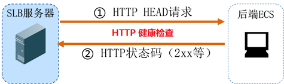

# 分布式架构
## 接入层
图

# 冗余备份
## 健康检查
### HTTP/HTTPS监听

### TCP监听

### UDP监听

### 健康检查时间窗示例
- 健康检查间隔 (每隔多久进行一次健康检查)
- 响应超时时间 (等待服务器返回健康检查的时间)
- 检查阈值 (健康检查连续成功或失败的次数)
- 健康检查失败时间窗=(检查间隔+响应超时时间)×不健康阈值
- 健康检查成功时间窗=检查间隔×健康阈值
- 如果目标ECS的健康检查失败，新的请求不会再分发到相应ECS上，所以对前端访问没有影响。
- 如果目标ECS的健康检查成功，新的请求会分发到该ECS上，前端访问正常。
- 如果目标ECS存在异常，正处于健康检查失败时间窗，而健康检查还未达到检查失败判定次数（默认为三次），则相应请求还是会被分发到该ECS，进而导致前端访问请求失败。  

## 主备切换
### Master/Backup
一个Master提供服务，其它Backup备份待命。
### 选举
Master挂了，从Backup里重新产生一个Master
### 脑裂

### 至少三个节点组成集群
N/2+1以上的节点通过才能够成功选举出Master
## VRRP虚拟路由冗余协议
### 协议文档
[rfc3768](files/rfc3768.txt)
### 网络结构

### 基本概念
- VRRP路由器：运行VRRP协议一个或多个实例的路由器
- 虚拟路由器：由一个Master路由器和多个Backup路由器组成。其中，无论Master路由器还是Backup路由器都是一台VRRP路由器，下行设备将虚拟路由器当做默认网关。
- VRID：虚拟路由器标识，在同一个VRRP组内的路由器必须有相同的VRID，其实VRID就相当于一个公司的名称，每个员工介绍自己时都要包含公司名称，表明自己是公司的一员，同样的道理，VRID表明了这个路由器属于这个VRRP组。
- Master路由器：虚拟路由器中承担流量转发任务的路由器
- Backup路由器：当一个虚拟路由器中的Master路由器出现故障时，能够代替Master路由器工作的路由器
- 虚拟IP地址：虚拟路由器的IP地址，一个虚拟路由器可以拥有一个或多个虚拟IP地址。
- IP地址拥有者：接口IP和虚拟路由器IP地址相同的路由器就叫做IP地址拥有者。
- 主IP地址：从物理接口设置的IP地址中选择，一个选择规则是总是选用第一个IP地址，VRRP通告报文总是用主IP地址作为该报文IP包头的源IP。
- 虚拟MAC地址：组成方式是00-00-5E-00-01-{VRID}，前三个字节00-00-5E是IANA组织分配的，接下来的两个字节00-01是为VRRP协议指定的，最后的VRID是虚拟路由器标识，取值范围[1，255]
### 报文组成

# 负载均衡
## 工作模式
### HTTP重定向

### DNS负载均衡

### 反向代理负载均衡(nginx)

### 网络地址转换(LVS)

### IP隧道(LVS)
- 客户请求数据包，目标地址VIP发送到LB上。
- LB接收到客户请求包，进行IP Tunnel封装。即在原有的包头加上IP Tunnel的包头。然后发送出去。
- RS节点服务器根据IP Tunnel包头信息（此时就有一种逻辑上的隐形隧道，只有LB和RS之间懂）收到请求包，然后解开IP Tunnel包头信息，得到客户的请求包并进行响应处理。
- 响应处理完毕之后，RS服务器使用自己的出公网的线路，将这个响应数据包发送给客户端。源IP地址还是VIP地址。（RS节点服务器需要在本地回环接口配置VIP）
### 直接路由(LVS)

## 调度算法
### RR（Round Robin Scheduling)
轮询算法，它将请求依次分配给不同的rs节点，也就是RS节点中均摊分配。这种算法简单，但只适合于RS节点处理性能差不多的情况
### WRR（Weighted Round-Robin Scheduling）
加权轮询调度，它将依据不同RS的权值分配任务。权值较高的RS将优先获得任务，并且分配到的连接数将比权值低的RS更多。相同权值的RS得到相同数目的连接数。
### WLC（Weighted Least-Connection Scheduling）
加权最小连接数调度，假设各台RS的权值依次为Wi，当前tcp连接数依次为Ti，依次去Ti/Wi为最小的RS作为下一个分配的RS
### DH（Destination Hashing Scheduling）
目的地址哈希调度以目的地址为关键字查找一个静态hash表来获得需要的RS
### SH（Source Hashing Scheduling）
源地址哈希调度以源地址为关键字查找一个静态hash表来获得需要的RS
### LC（Least-Connection Scheduling）
最小连接数调度,IPVS表存储了所有活动的连接。LB会比较将连接请求发送到当前连接最少的RS.
### LBLC（Locality-Based Least Connections Scheduling）
基于地址的最小连接数调度：将来自同一个目的地址的请求分配给同一台RS，此时这台服务器是尚未满负荷的。否则就将这个请求分配给连接数最小的RS，并以它作为下一次分配的首先考虑。
### LBLCR（Locality-Based Least Connections with Replication Scheduling）
带复制的基于局部性最少链接调度算法也是针对目标IP地址的负载均衡。LBLCR算法先根据请求的目标IP地址找出该目标IP地址对应的服务器组；按“最小连接”原则从该服务器组中选出一台服务器，若服务器没有超载， 将请求发送到该服务器；若服务器超载；则按“最小连接”原则从整个集群中选出一台服务器，将该服务器加入到服务器组中，将请求发送到该服务器。同时，当该 服务器组有一段时间没有被修改，将最忙的服务器从服务器组中删除，以降低复制的程度。
## 算法选择
- 一般的网络服务，如http，mail，mysql等常用的LVS调度算法为：  
基本轮询调度RR  
加权最小连接调度WLC  
加权轮询调度WRR  
- 基于局部性的最小连接LBLC和带复制的给予局部性最小连接LBLCR主要适用于web cache和DB cache
- 源地址散列调度SH和目标地址散列调度DH可以结合使用在防火墙集群中，可以保证整个系统的出入口唯一。  

实际适用中这些算法的适用范围很多，工作中最好参考内核中的连接调度算法的实现原理，然后根据具体的业务需求合理的选型。

# 思考
1. 抢占选举是如何进行的？
2. IP地址拥有者的作用？
3. vrrp如何应对脑裂？

# 参考资料
[rfc3768](https://tools.ietf.org/rfc/rfc3768.txt)
[免费ARP](https://arthurchiao.github.io/blog/gratuitous-arp-cn-zh/)
[keepalived与VRRP](http://hugnew.com/?p=745)
[LVS介绍](http://www.linuxvirtualserver.org/zh/lvs1.html)